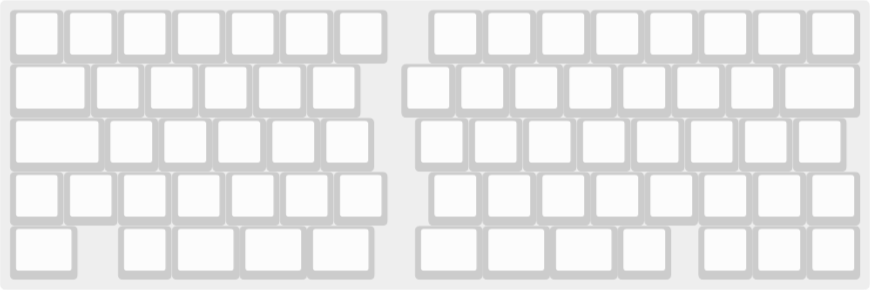
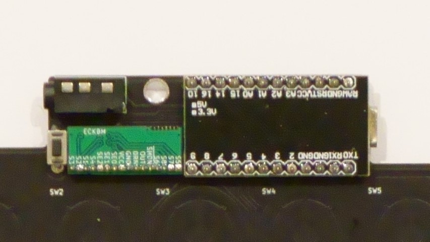

# GRS-70ECビルドガイド





- [部品リスト](#部品リスト)
  - [キットに同梱されている部品](#キットに同梱されている部品)
  - [キット以外に必要な部品](#キット以外に必要な部品)
- [組み立て手順](#組み立て手順)
  - [メイン基板に部品をはんだ付けする](#メイン基板に部品をはんだ付けする)
  - [スイッチを組み立てる](#スイッチを組み立てる)
  - [トッププレートにスイッチをはめる](#トッププレートにスイッチをはめる)
  - [片手づつ全体を組み立てる](#片手づつ全体を組み立てる)
    - [ボトムプレートにスペーサをつける](#ボトムプレートにスペーサをつける)
    - [ラバーシートを切る](#ラバーシートを切る)
    - [円錐バネを入れる](#円錐バネを入れる)
    - [メイン基板、ミドルプレートを取り付ける](#メイン基板ミドルプレートを取り付ける)
    - [トッププレート、Pro Microカバーを固定する](#トッププレートpro-microカバーを固定する)
  - [ゴム足、キーキャップをつける](#ゴム足キーキャップをつける)
  - [ファームウェアを書き込む](#ファームウェアを書き込む)
  - [動作点を調整する](#動作点を調整する)
  - [ルブについて](#ルブについて)

## 部品リスト
### キットに同梱されている部品

| 部品                 | 数  |
| -------------------- | --- |
| メイン基板           | 2   |
| トッププレート       | 2   |
| ミドルプレート       | 2   |
| ボトムプレート       | 2   |
| Pro Microカバー      | 2   |
| TRRSジャック         | 2   |
| タクトスイッチ       | 2   |
| スキャン用モジュール | 2   |
| ピンヘッダ           | 2   |
| 黄色LED              | 2   |
| 2.2kΩ抵抗            | 2   |
| M2x4ネジ             | 32  |
| M2x9ネジ             | 4   |
| M2x8スペーサー       | 16  |
| M2ナット             | 4   |
| ゴム足               | 8   |


### キット以外に必要な部品

| 部品                              | 数       | 入手先                                                                                                |
| --------------------------------- | -------- | ----------------------------------------------------------------------------------------------------- |
| Pro Micro                         | 2        | 遊舎工房など                                                                                          |
| TRRSケーブル                      | 1        | 遊舎工房など                                                                                          |
| USBケーブル                       | 1        | 遊舎工房など                                                                                          |
| 12ピンコンスルーまたはピンヘッダ  | 4        | https://yushakobo.jp/shop/a01mc-00/<br> https://talpkeyboard.stores.jp/items/5e056626d790db16e2889233 |
| ADELCPS 静電容量スイッチ4点セット | 70キー分 | https://yushakobo.jp/shop/a0500es-01-1/<br> https://btoshop.jp/2020/09/25/adelcps/mp                  |
| ラバードーム                      | 必要分   | https://yushakobo.jp/shop/a0500er-01-1/<br> https://btoshop.jp/2020/09/25/adelcpru/                   |
| キーキャップ                      |          |                                                                                                       |

## 組み立て手順
### メイン基板に部品をはんだ付けする
  - TRRSジャックは浮かないようにしっかり押し込んでください。
  - スキャン用モジュールは1番ピン(四角いランド)をあわせて裏向きに取り付けます。ピンヘッダの長いほうがモジュール側です。
    - ピンヘッダの長い方はブリッジしやすいので、難しく感じる場合には短く切ってからはんだ付けしたり、ブリッジしてしまった場合にはハンダ吸い取り線などで取り除いたりしてください
  - LEDは取り付け向きに注意してください。足の短いほうがカソード(縦棒の方)です。
  - Pro Microは裏向きに取り付けます。コンスルーのはんだ付けについては遊舎工房などのガイドを確認してください。
  - はんだ付けが必要な部分は以上なので、以降はハンダゴテは使いません。
  
  |||
  |-|-|
  |左手|右手|
  |||
  |LEDの向きに注意||

### スイッチを組み立てる
  - プランジャに静音リングをつけて、ハウジングに入れます。静音リングが途中でねじれたり巻き込まれたりしないように注意してください。
    |||
    |-|-|
    |静音リングをつける|ハウジングに入れる|

### トッププレートにスイッチをはめる
  - トッププレートにスイッチをはめていきます。スイッチ下部の突起が左右を向くようにしてください。

### 片手づつ全体を組み立てる
  - 部品がバラバラにならないように片手づつ全体を組み立てていきます。

#### ボトムプレートにスペーサをつける
  - M2x4ネジでボトムプレートにスペーサをネジ止めします。 

#### ラバーシートを切る
  - スイッチの配置に合うようにラバーシートを切って載せていきます。

#### 円錐バネを入れる
  - ラバーシートに円錐バネをいれます。2個重ねて入れないように注意してください。
    |||
    |-|-|
    |左手|右手|

#### メイン基板、ミドルプレートを取り付ける
  - ひっくり返った状態のトッププレートにメイン基板、ミドルプレートを載せて、ミドルプレートの6角穴にナットを入れます。
  - ボトムプレートも載せたら中身がこぼれないように全体をひっくり返してスイッチを表側にします。
  - M2x9のネジでとナットでトッププレートとメイン基板を固定します。
    - このネジを強く締めすぎると、ホームポジション付近のスイッチのバネ鳴りが酷くなる場合があります。組み立て後、必要に応じて締め具合を調整してください。
  - ハンダに不安があればこの段階で動作確認してください。

#### トッププレート、Pro Microカバーを固定する
  - トップレートとPro Microカバーをネジ止めします。

### ゴム足、キーキャップをつける
  - ハードウェアはこれで完成です

### ファームウェアを書き込む
  - ファームウェアの入っているリポジトリ
    https://github.com/sekigon-gonnoc/qmk_firmware/tree/dev/sekigon
  - 左右の判別にEE_HANDSを使っているので、少なくとも最初の書き込みには`-split-left`または`-split-right`をつけてください。
    ```bash
      # 左手
      make sekigon/grs_70ec:default:avrdude-split-left
      # 右手
      make sekigon/grs_70ec:default:avrdude-split-right
    ```
  - VIA対応のファームを使う場合は[grs-70ec.json](grs-70ec.json)を指定してください。

### 動作点を調整する
  - QMK Toolboxまたは[web-hid-listen](https://sekigon-gonnoc.github.io/web-hid-listen/)に接続すると各キーの読み取り値が表示されます。  
  - 動作点を調整する場合はこの値の変化を踏まえてconfig.hのしきい値を調整してください。
    ```c
    #define HIGH_THRESHOLD 300
    #define LOW_THRESHOLD 200
    ```

### ルブについて
  - バネ鳴りやスイッチのカサつきはメカニカルスイッチ同様に潤滑剤を塗ることで改善する場合があります
    - ハウジングとプランジャの摺動部への塗布
    - スプリングのバッグルブ(Bag lube)